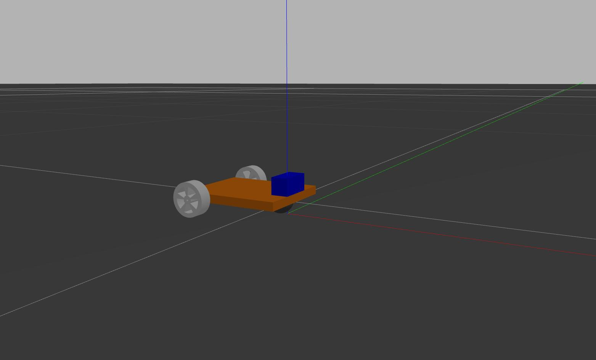

# Gmapping using Differential Drive Robot

### Usage
1. Start ROS Master
```
$ roscore
```

2. Start the Simulation
```
$ roslaunch differential_drive_description gazebo.launch
````

3. Run the Teleop Keyboard
```
$ rosrun differential_drive_robot teleop_keyboard.py
```

### Gazebo View



### To be done
1. Setting a demo world.
2. <del> Adding gmapping algorithm. </del>

### Issues
1. Map is empty
