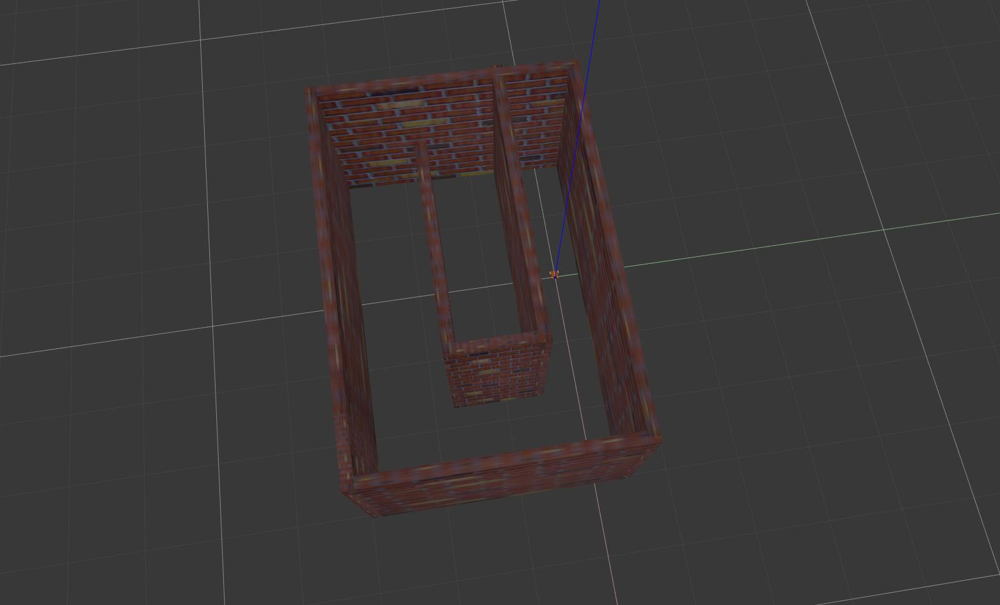

# Gmapping using Differential Drive Robot

### Usage
1. Start ROS Master
```
$ roscore
```

2. Start the Simulation
```
$ roslaunch differential_drive_description gazebo.launch
````

3. Run the Teleop Keyboard
```
$ rosrun differential_drive_robot teleop_keyboard.py
```

### Dependencies
1. Gmapping Package
```
$ sudo apt-get install ros-[DISTRO_NAME]-gmapping*
```

2. Differential Driver Controller
```
$ sudo apt-get install ros-[DISTRO_NAME]-diff-drive-controller*
```

### Gazebo View
1. Model View


2. World


### Improvements
1. Improved Interial Matrix
2. Improved Odometry

### To be done
1. <del> Setting a demo world. </del>
2. <del> Adding gmapping algorithm. </del>

### Issues
1. <del> Map is empty </del>
2. <del> Weird map is generated </del>
